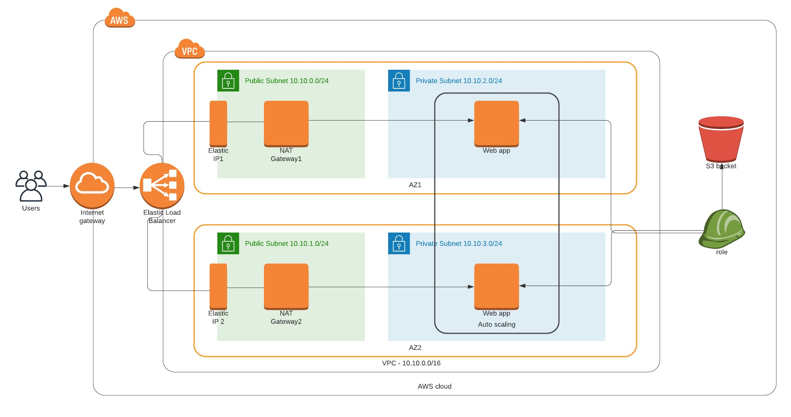

# Udacity Project 2
## Description
The purpose of that project was to create Cloudformation scripts to deploy a Web servers in Ubuntun18 instances, which content to be pulled from S3 Bucket. 

## Architecture


## Files included
* 1-infra-net.yaml - CloudFormation network stack
* 1-infra-net-params.json - parameters file for network stack
* 2-infra-servers.yaml - CloudFormation server/service stack
* 2-infra-servers-params.json - parameters file for server/service stack
* Udacity_Proj2.jpeg - infrastructure diagram

## Execute the project
1. Start network stack:
```
aws cloudformation create-stack --stack-name udacity-proj2-net --template-body ./1-infra-net.yaml --parameters ./1-infra-net-params.yaml --region=us-west-2
```

2. When first is complete, start server/service stack:
```
aws cloudformation create-stack --stack-name udacity-proj2-server--template-body ./2-infra-servers.yaml --parameters ./2-infra-servers-params.json
```

## Output
Server/service stack outputs Web Page URL.

